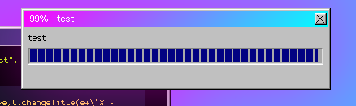
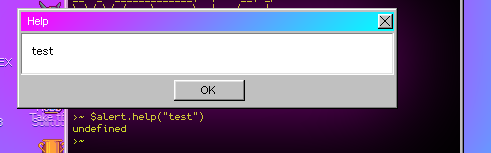

# Examples
This detects wherether the "Cancel" or "OK" button has been pressed:
```js
$confirm('click a button', function (ok){
  if (ok) {
    $alert('You pressed OK.')
  } else {
    $alert('You pressed Cancel.')
  }
});
// note: this works not just on $confirm, but on $alert, $alert.info/error, even $prompt and $window.form (which we’ll get on to later)
```

You can open an application from $fs.utils.getMenuOpenWith() by using the action function in the object of each application:
```js
$fs.utils.getMenuOpenWith('/a/trash/trash.jpg')[0].action();
// Image Viewer is the first object in the array because it’s an image so execute that using the action function
```

How would I get the text inputted into a prompt?
```js
$prompt('Please insert your credit card number.', '', function(ok, text) {
  if (ok) {
    $alert(text)
  }
});
```

How to use $window properly:

```js
// put the $window in a variable
var myWindow = $window('url-or-whatever'); //right, returns an object with things to interact with the window or just information ect

/* you can use it like you would with $window, except $window.current is whatever you named the variable and to make the window the active window, just use the active() function

or for a more efficient and genuinely better way to create windows, read on!*/

var myWindow = $window({url: 'http://insert-url.he.re', title: 'title', icon: '/c/sys/skins/w93/question.png', width: 420, height: 420});
/* this will create a window with the properties or whatever already set for you

you can also do more things such as making the window maximizable, minimizable, resizable or closable and lots more with this method!

to avoid making this too long, i’m just going to state some useful keys, arrays, objects and stuff to append to the object thingy in the function as well as saying what they do


resizable (boolean) makes the window resizable
maximizable (boolean) makes the window maximizable
minimizable (boolean) makes the window minimizable
draggable (boolean) makes the window movable
closable (boolean) makes the window closable
dockable (boolean) makes the window appear on the taskbar
center (boolean) makes the window centered
automaximize (boolean) automatically maximizes the window
help (string) text that appears when pressing the help button on the window
footer (string) text that is on the bottom of the window
contextmenu (object) the things that appear when you right click on task on the taskbar
menu (array) the menu item thingies on the top of the window, scroll down for explanation
animationIn/Out (string) animations for when you open/close the window, animation names here: https://pastebin.com/4S1FCBEQ (thanks janken)
onactive (callback) executed when the window is the active window
oncancel (callback) executed when the cancel button is pressed
onclose (callback) executed when the window is closed
ondestroy (callback) executed when the window is destroyed (basically closed, but different in a way)
ondrag (callback) executed when the window is being dragged
ondragstop (callback) executed when the window has stopped being dragged
onminimize (callback) executed when the window has been minimized
onok (callback) executed when the ok button has been pressed
onopen (callback) executed when the window is opened
onready (callback) executed when the window is fully loaded?
*/
```

How to do dialogs properly:
```js
/* alright, now that you know how to use $window properly, dialog function thingies are the same! and by same, they both accept the same keys in the object etc... */
```

How to use the menu property in $window:
```js
var myWindowWithAMenu = $window({
  url: "about:blank",
  menu: [
    {
      name: "A top-level menu item",
      items: [
        {
          name: "Option 1",
          action: function () {
            $alert("You picked Option 1!");
          }
        },
        {name:"---"}, // This will create a separator.
        {
          name: "Option 2",
          action: function () {
            $alert("You picked Option 2!");
          }
        }
      ]
    },
    {name: "Another top-level menu item!"}
  ]
});

// this code will result in the image below
```


How to start a file selector:
```js
$explorer('a/', {browse: true, explorer: true, onclose: function(ok, file) {
  // ok = did the user press ok?
  // file = the name of the file
  $alert(`I selected ${file}!`);
}});
```
How to use $alert.progress:
```js
var progressBar = $alert.progress("body","title") // spawns bar
progressBar.update(33) // updates the progress and title. takes an integer input 0-100.
```

Usage of $alert.help:
```js
$alert.help("<strong>html</strong>") // works with the same HTML as the previous, but with a white canvas as the background. Also, the title is fixed to 'Help'
```


This is how to use CLI (from docs)
```
le._apps.cli = {
exec: function() {
var Args = this.arg.arguments;
$log(Args)
// or you can do this:
$log.red(Args[0])
$log.cyan(Args[1])
/*
As well as this, you can use something to check if its undefined.
*/
},
hascli: true,
terminal: true,
}
```
