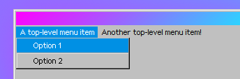

# Windows 93 JavaScript
*Created by Domenic Waterdash, Draco, DarkPhoenix10 and 1024x2*
Please note that new things may be discovered.

# Things that may come in handy
```js
$prompt('prompt text here', 'text in prompt text box') //displays a prompt message
$notif('notif text here') //displays a notification bubble on the bottom right
$alert('alert text here') // displays an alert message
$alert.info('info text here') // displays an info message
$alert.error('error text here') // displays an error message
$confirm('confirm text here') // displays a question dialog
// (you can put html in these functions)
// there's a lot more to these functions as listed here. i plan to make a more detailed documentation of these in the future. (clue: passing objects to them and do more while writing less, as well as more features)
$window('http://example.com') // opens a website in a window (bear in mind that some websites do not work in this) due to cross-origin related stuff
$explorer('/c/a folder somewhere'); //opens up an explorer window in that directory
$exe('application name') // open an application of your choice
$explorer.setCurrent(id) // find the explorer window via id then focus on it (0 is always the desktop)
$window.current.maximize() // toggles between maximising to the window that is currently being used
$window.current.minimize(); // minimise the window that's currently being focused on
$window.current.restore(); // if the window that's currently being used has been minimised, open it back up again.
$window.current.destroy(); // closes the window that's currently being focused on (no animation)
$window.current.close(); // same as destroy but with animation

new Audio('/path/to/audio/audio.mp3').play(); // doesn't work with wav files sadly (btw the audio doesn't have to be on the windows 93 website)
$audio('alert').play() // similar to `new Audio().play()`
$boot.VERSION // returns the w93 version
system42.data._path // returns directories of things (.desktop returns where the desktop is located, .home returns where the users home is and .skin returns the folder the skin is)
system42.data._selected // returns an array of every shortcut or file selected at that moment
$explorer.current.getPath() // returns the path of the folder you're currently in from the explorer window you're currently using (can also be desktop)
$explorer.current // returns an object containing information about the explorer window you're currently using ( $explorer.current.id returns an id that you can use with $explorer.setCurrent(id))
$fullscreen() // toggle fullscreen
$fs.utils.getInfo('/a/file/dir.js'); // gives out info of that file in an object
location.reload() // restarts windows 93
$window.current.id // gets the id of the current window
$explorer.exe.SelectAll() // select everything in the current explorer window (can also be desktop)
$explorer.exe.EditShortcut() // open the edit shortcut dialog for the thing that is currently selected
$window.current.changeTitle('title'); // changes the title of the window that's currently being focused on
$window.current // returns an object containing info about the program that's currently being focused on
$window.current.cfg // returns all sorts of info about the program that's currently being focused on (is too big so i can't put everything here)
$window.current.changeIcon('/a/path/to/an/image.png') // set the icon of the window that's currently being focused on to something else (image doesn't have to be on w93, can be off another website)
$window.current.changeSize({width: 640, height: 480}) // set the size of the current window in pixels (some windows have a size limit)
le._apps // returns all applications in objects
$fs.utils.exist('/a/file/dir.js') // check if a file exists, and if it exists, returns 0, if it doesn't exist, return false// if it's a folder you're specifying, it'll just return the contents of it in objects
$fs.utils.getMenuOpenWith('/a/file/location.js') // returns the programs you can open the specified file with in an array with each application in an object
$fs.utils.getFileMenu('/a/directory') //however, if you want a neater directory or whatever listing, then use the "foldersList" array in this
// file creation
localforage.setItem('filename.txt', 'hello world') // create/edit file, only effective after a restart or explorer refresh
localforage.getItem('filename.txt').then(function(okthen){return okthen}) // get contents of a file
$store.set('desktop/meme.txt', 'hello world'); // alternative method to creating/editing files, effective sometimes for files that already exist
$store.getRaw('desktop/meme.txt') // alternative method to reading files, effective sometimes for files that already exist
$explorer.refresh() // refresh explorer
$archive('/folder/name')  // put the contents of the folder into a zipped archive that you can download
```
## Malicious:
```js
system42.data._settings.skin = "TOPKEK"; // changes the iconset to one that doesn't exist which causes all icons to fail loading unless you change the var back to 'w93'
// arc is now irrelevant.
$explorer.exe.Open($explorer.exe.SelectAll()) // select every file from the current explorer session and execute them
$explorer.exe.Delete($explorer.exe.SelectAll()); // select every file from the current explorer session and delete them
$file.format(function(){document.location.reload(true)}) // re-installs windows 93 (thanks domenic)
$file.delete("/a/") // deletes /a/, messes up a lot of things.
```

# Examples
This detects wherether the "Cancel" or "OK" button has been pressed:
```js
$confirm('click a button', function (ok){
  if (ok) {
    $alert('You pressed OK.')
  } else {
    $alert('You pressed Cancel.')
  }
});
// note: this works not just on $confirm, but on $alert, $alert.info/error, even $prompt and $window.form (which we’ll get on to later)
```

You can open an application from $fs.utils.getMenuOpenWith() by using the action function in the object of each application:
```js
$fs.utils.getMenuOpenWith('/a/trash/trash.jpg')[0].action();
// Image Viewer is the first object in the array because it’s an image so execute that using the action function
```

How would I get the text inputted into a prompt?
```js
$prompt('Please insert your credit card number.', '', function(ok, text) {
  if (ok) {
    $alert(text)
  }
});
```

How to use $window properly:

```js
// put the $window in a variable
var myWindow = $window('url-or-whatever'); //right, returns an object with things to interact with the window or just information ect

/* you can use it like you would with $window, except $window.current is whatever you named the variable and to make the window the active window, just use the active() function

or for a more efficient and genuinely better way to create windows, read on!*/

var myWindow = $window({url: 'http://insert-url.he.re', title: 'title', icon: '/c/sys/skins/w93/question.png', width: 420, height: 420});
/* this will create a window with the properties or whatever already set for you

you can also do more things such as making the window maximizable, minimizable, resizable or closable and lots more with this method!

to avoid making this too long, i’m just going to state some useful keys, arrays, objects and stuff to append to the object thingy in the function as well as saying what they do


resizable (boolean) makes the window resizable
maximizable (boolean) makes the window maximizable
minimizable (boolean) makes the window minimizable
draggable (boolean) makes the window movable
closable (boolean) makes the window closable
dockable (boolean) makes the window appear on the taskbar
center (boolean) makes the window centered
automaximize (boolean) automatically maximizes the window
help (string) text that appears when pressing the help button on the window
footer (string) text that is on the bottom of the window
contextmenu (object) the things that appear when you right click on task on the taskbar
menu (array) the menu item thingies on the top of the window, scroll down for explanation
animationIn/Out (string) animations for when you open/close the window, animation names here: https://pastebin.com/4S1FCBEQ (thanks janken)
onactive (callback) executed when the window is the active window
oncancel (callback) executed when the cancel button is pressed
onclose (callback) executed when the window is closed
ondestroy (callback) executed when the window is destroyed (basically closed, but different in a way)
ondrag (callback) executed when the window is being dragged
ondragstop (callback) executed when the window has stopped being dragged
onminimize (callback) executed when the window has been minimized
onok (callback) executed when the ok button has been pressed
onopen (callback) executed when the window is opened
onready (callback) executed when the window is fully loaded?
*/
```

How to do dialogs properly:
```js
/* alright, now that you know how to use $window properly, dialog function thingies are the same! and by same, they both accept the same keys in the object etc... */
```

How to use CLI arguments:
```js
le._apps.testargs = {
  exec: function()
  {
    var myArgs = this.arg.arguments;
    // each argument is returned in an array value
    // for example: "testargs hello world" would return: ["hello", "world"]
    $log.pass(myArgs.join(', '));
  },
  hascli: true,
  terminal: true
}
// now that the app is registered, you can just test it by doing
// testargs arg1 arg2 etc
```

How to use the menu property in $window:
```js
var myWindowWithAMenu = $window({
  url: "about:blank",
  menu: [
    {
      name: "A top-level menu item",
      items: [
        {
          name: "Option 1",
          action: function () {
            $alert("You picked Option 1!");
          }
        },
        {name:"---"}, // This will create a separator.
        {
          name: "Option 2",
          action: function () {
            $alert("You picked Option 2!");
          }
        }
      ]
    },
    {name: "Another top-level menu item!"}
  ]
});

// this code will result in the image below
```



How to implement a file selector:
```js
$explorer('a/', {browse: true, explorer: true, onclose: function(ok, file) {
  // ok = did the user press ok?
  // file = the name of the file
  $alert(`I selected ${file}!`);
}});
```
